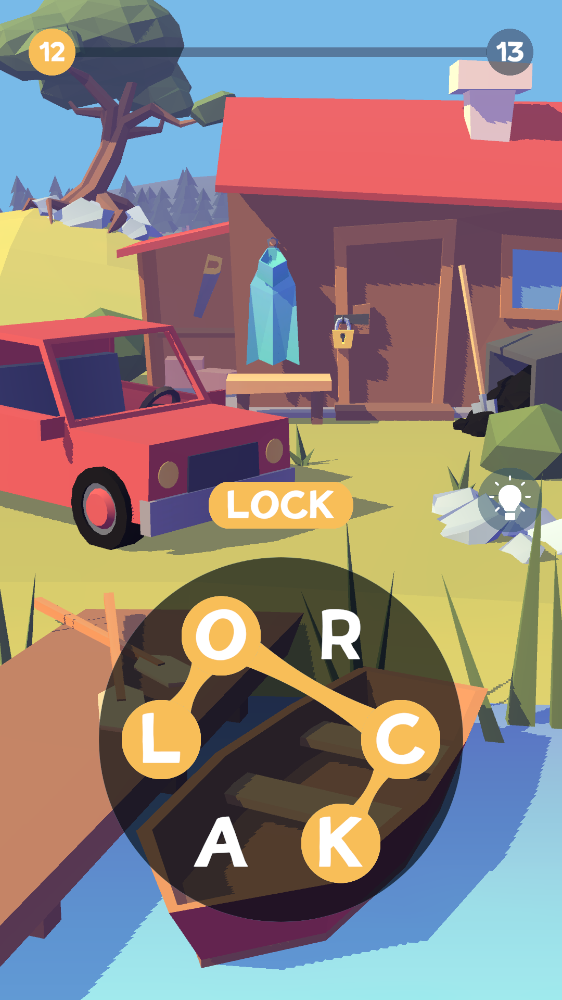

# Fillworld
Fillworld is a hyper-casual sample project that demonstrates the use of the <b>CleanRx</b> framework.




## CleanRx

<b>CleanRx</b> is a lightweight framework based on merging two concepts: <b>ECS</b> and <b>Reactive Programming</b>.
It uses UniRx under the hood, and gives you an ability to write a very declarative code, and in the same time decouple data and behavior.

Here is a short example:

```csharp

public class CompleteLevelLogic : IInitializable
{
    [Inject] readonly LevelIndex _levelIndex;
    [Inject] readonly CompositeDisposable _lifecycle;

    Group _actors;
    Group _matchedActors;

    [Inject] void GetGroups(CleanRx.Context context)
    {
        _actors = context.GetGroup()
            .With<Name>()
            .Without<IsExtra>();
        _matchedActors = context.GetGroup()
            .With<Name, Matched>()
            .Without<IsExtra>();
    }

    public void Initialize()
    {
        _matchedActors.ObserveAdd
            .Where(_ => _matchedActors.Count == _actors.Count)
            .Throttle(TimeSpan.FromMilliseconds(1000))
            .Subscribe(actor => _levelIndex.Value++)
            .AddTo(_lifecycle);
    }
}
```

When all the actors on the level are found, it waits for one second, and then increases `_levelIndex`.
And since `_levelIndex` component is a reactive property, it triggers another "logic" which instantiates next level.

As you can see, a complex logic can be written in a very short and declarative manner, increasing a readability and easy for modify.
<b>UniRx</b> on the other hand gives you a bunch of powerful operators to filter, project and modify different entities streams <b>(Groups)</b>.

The main difference between traditional ecs approach and CleanRx is an instant reaction while processing entities and components.

I also use <b>Zenject</b> to manage dependencies (but it can be easily replaced with a Pure DI or another DI framework) However I strongly believe that <b>dip</b> is a very important principle for creating scalable architecture. 
  
## Project structure

* Composition // Composition root of the project (Installers, Factories and Settings)
* Simulation // Data and logic layer
* Presentation // Binding View and Simulation together (using Reactive presenter pattern)
* View // View layer
* External // for external libs (analytics, advertisements, native)

## Reactive Presenter (M-V-RP)
Reactive Presenter is a binding between <b>Model</b> (or simulation) and <b>View</b> layers.

All the models (`Entities, Groups`) and views (`Monobehaviors, Gameobjects`) are usually injected from the `composition layer`.

Real example:
```csharp

public class LetterWidget : PanelPresenter, IInitializable, IPointerDownHandler
    {
        [Inject] Entity _letter;
        [Inject] LetterSelected _selected;
        [Inject] CursorDown _cursorDown;

        [SerializeField] TMPro.TMP_Text _label;
        [SerializeField] Image _selectionImage;

        public void Initialize()
        {
            _label.text = _letter.Get<Letter>().Value.ToString();

            _letter.HasAsObservable<Active>()
                .Subscribe(value =>
                {
                    _selectionImage.gameObject.SetActive(value);
                }).AddTo(this);
        }

        public void OnPointerDown(PointerEventData eventData)
        {
            _selected.Invoke(_letter);
        }
    }
 ```

## Lifecycles
Lifecycles - is a composite disposables, which represents the lifitime of a certain context and holds all it's subscriptions.
When context is destroyed, all the subsctiptions disposed too.
## About
* Environment art (3d models and animations) done by [Arkadiy Peregoedov](https://www.artstation.com/peregoedovart)
* Project was made for [GameFirst mobile](https://gamefirst.ru) (c)
